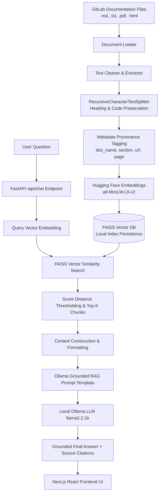

# GitLab Product Documentation Helper - RAG Architecture

This document provides a technical deep-dive into the Retrieval-Augmented Generation (RAG) pipeline implemented in this project.

## High-Level RAG Architecture Diagram



## RAG Pipeline Stages Breakdown

### 1. Document Ingestion (`backend/app/services/ingestion/loader.py`)
- Reads Markdown (`.md`), Plain Text (`.txt`), PDF (`.pdf`), and HTML documentation files.
- Extracts source metadata such as `document_name`, `source_url`, `page_number`, `document_type`, and section titles.

### 2. Intelligent Chunking (`backend/app/services/ingestion/chunker.py`)
- Uses `RecursiveCharacterTextSplitter` with chunk size 800 and overlap 150.
- Preserves section headings (`##`, `###`), code blocks (` ``` `), and bullet lists to maintain semantic meaning.
- Attaches unique `chunk_id` and metadata provenance to every chunk.

### 3. Embeddings (`backend/app/services/embeddings/embedding_service.py`)
- Utilizes Hugging Face's `sentence-transformers/all-MiniLM-L6-v2` model (384-dimensional dense vectors).
- Converts text chunks into normalized vector embeddings.

### 4. Vector Database & Indexing (`backend/app/services/vectorstore/faiss_store.py`)
- FAISS (Facebook AI Similarity Search) stores document vectors.
- Index is saved locally to disk (`backend/vectorstore_db/faiss_index`) for fast startup without re-indexing.
- Incremental indexing and complete re-indexing supported via REST API.

### 5. Retrieval & Thresholding (`backend/app/services/rag/retriever.py`)
- Configurable `TOP_K=5`.
- Filters out low-relevance results using similarity distance scoring.
- Formats structured source citations (document name, section heading, URL, relevance match percentage, snippet preview).

### 6. Grounded Prompt Engineering (`backend/app/services/rag/prompt_templates.py`)
- System prompt instructs local Ollama LLM to answer strictly based on retrieved documentation context.
- Explicit guardrail: If the answer is not contained in the context, returns `"I couldn't find this information in the available GitLab documentation."` to prevent hallucination.

### 7. Evaluation & Benchmark Suite (`backend/app/services/evaluation/evaluator.py`)
- Automated benchmark testing measuring Groundedness Rate (%), Retrieval Latency (sec), and Topic Relevance.
